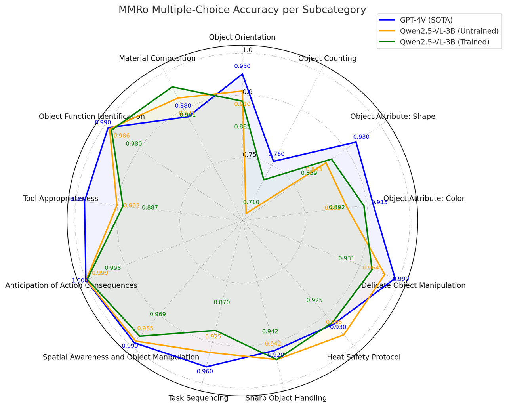
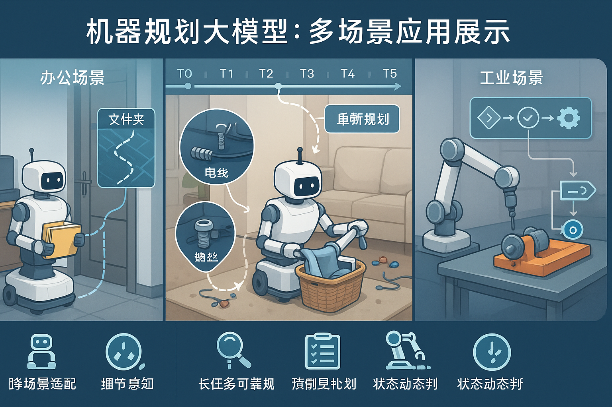
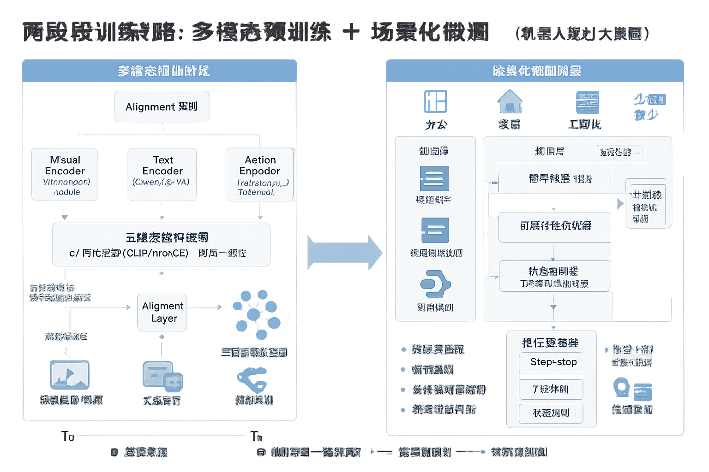
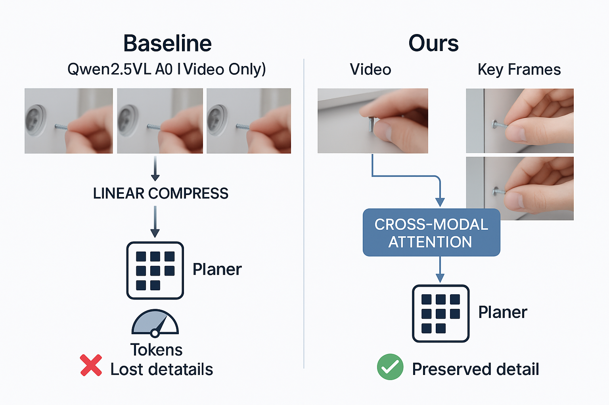
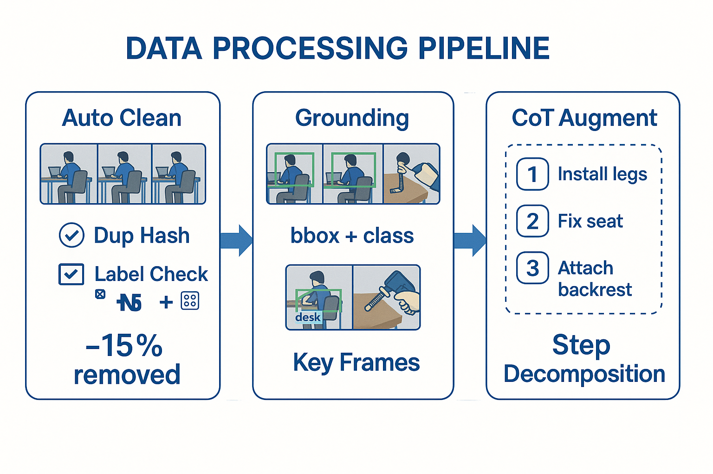
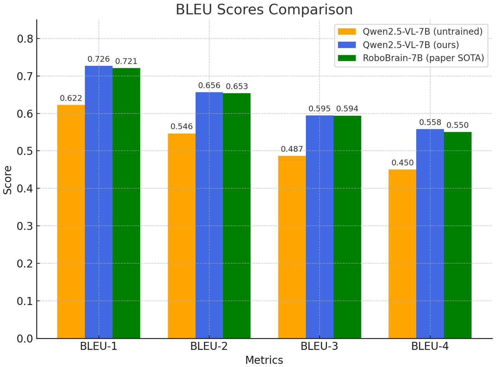
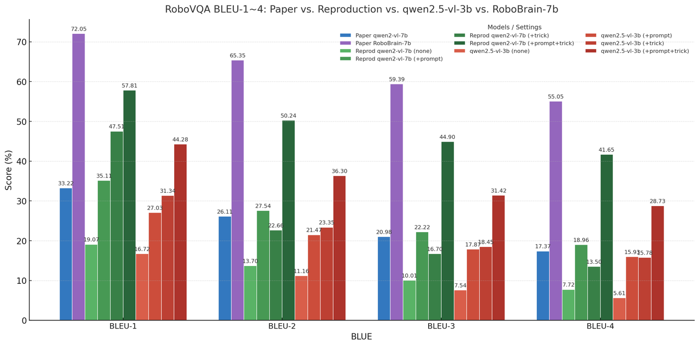

  

   

# 优必选科技机器人规划大模型

### [项目主页](https://your-project-page.com) | [技术报告](https://your-tech-report.pdf) | [演示视频](https://your-demo-video.com) | [论文](https://arxiv.org/abs/xxxx.xxxxx)

优必选科技自主研发的**机器人规划大模型**，基于 Qwen2.5VL 底座构建，通过“多模态预训练 + 场景化微调”两阶段技术策略，针对性解决通用视觉语言模型在机器人领域的三大核心痛点：**场景适配性差、场景细节理解缺失、长任务规划准确率低**，已在办公、家居、工业等多实际场景中实现性能突破，为机器人自主决策与执行提供核心能力支撑。

## 目录
1. [模型概述](#1-模型概述)
2. [核心技术方案](#2-核心技术方案)
3. [数据构建与增强](#3-数据构建与增强)
4. [实验结果](#4-实验结果)
5. [快速开始](#5-快速开始)
6. [模型卡与伦理声明](#6-模型卡与伦理声明)
7. [贡献指南](#7-贡献指南)
8. [许可证](#8-许可证)
9. [引用](#9-引用)

## 1. 模型概述
传统多模态大模型因训练数据与机器人实际场景存在显著**Domain Gap**，在机器人规划任务中常出现“幻觉生成、目标漏识别、步骤漏规划”等问题；同时，机器人任务规划需额外具备**实时任务状态判断**与**时间序列信息理解**能力，通用模型难以满足。

本模型通过定制化改造与场景化优化，实现以下核心能力：
- **跨场景适配**：兼容办公（文件递送、设备巡检）、家居（家务协助、环境整理）、工业（物料搬运、装配指导）等多场景规划需求；
- **细节感知**：精准识别场景中的小目标（如螺丝、电线）与环境约束（如障碍物、操作空间限制）；
- **长任务可靠规划**：支持多步骤、跨时间维度的任务拆解（如“组装家具”“设备维护全流程”）；
- **状态动态判断**：实时感知任务执行进度，动态调整规划步骤（如“物品位置偏移后重新规划抓取路径”）。

### 场景应用展示

  
    
   <em>图1：模型在办公、家居、工业场景的规划示例</em>

  
    
   <em>视频1：机器人基于模型规划的实际场景执行演示</em>

## 2. 核心技术方案
本模型围绕“提升机器人场景适配性与规划可靠性”设计两大核心技术模块，关键改进基于 Qwen2.5VL 底座展开。

### 2.1 两阶段训练策略：多模态预训练 + 场景化微调
针对通用模型与机器人场景的适配问题，采用分阶段训练模式：
1. **多模态预训练阶段**：基于 Qwen2.5VL 扩展机器人领域多模态数据（文本指令、场景图像/视频、动作序列），构建“视觉-文本-动作”三模态对齐表征；
2. **场景化微调阶段**：针对办公/家居/工业等细分场景，注入场景专属知识（如工业设备部件名称、家居物品摆放逻辑），并优化规划步骤的“可执行性”（如避免机器人无法完成的动作指令）。

#### 技术架构图

  
    
   <em>图2：“多模态预训练 + 场景化微调”两阶段架构</em>

### 2.2 Video + Key frame 输入增强：解决细节丢失问题
Qwen2.5VL 原方案通过线性层压缩视频特征以降低 Token 消耗，但会导致**视频细节丢失**（如小目标、动作细节），进而影响规划准确性。本模型提出创新输入格式：
- **Video 流**：保留视频时序信息，用于理解任务的动态过程（如“拧螺丝”的连续动作）；
- **Key frame 采样**：从视频中采样关键帧（如动作起始/结束帧、目标出现帧），通过高分辨率特征提取保留细节信息；
- **特征融合**：设计跨模态注意力模块，将 Video 时序特征与 Key frame 细节特征动态融合，在低 Token 消耗与高细节感知间实现平衡。

#### 输入格式对比演示

  
    
   <em>图3：左：Qwen2.5VL 原 Video 输入（细节模糊）；右：本模型 Video+Key frame 输入（细节清晰）</em>

## 3. 数据构建与增强
高质量的机器人规划数据是模型性能的核心支撑，本项目构建了一套覆盖多场景、高准确性的多模态数据集，并设计自动化数据处理流程。

### 3.1 数据集构成
整合公开数据集与自采数据，构建**规模超 200 万条视频**的机器人规划多模态数据集，具体构成如下：
| 数据来源       | 数据类型       | 规模       | 场景覆盖               |
|----------------|----------------|------------|------------------------|
| Ego4d          | 第一视角视频   | 50 万条    | 日常活动（行走、操作） |
| RoboVQA        | 机器人问答视频 | 30 万条    | 机器人操作指令响应     |
| ShareRobot     | 工业操作视频   | 20 万条    | 工业装配、搬运         |
| 优必选自采数据 | 多场景定制视频 | 100 万条   | 办公/家居/工业定制场景 |

### 3.2 数据清洗与增强
为提升数据质量与模型泛化能力，设计多步数据处理流程：
1. **自动化清洗**：通过“重复检测（基于视频帧哈希）+ 标注错误识别（基于规则与模型校验）”，去除约 15% 的低质量数据；
2. **Grounding 数据生成**：为关键帧添加“目标 bounding box + 类别标签”（如“办公桌[xyxy]”“螺丝刀[xyxy]”），强化模型目标定位能力；
3. **CoT 数据增强**：为长任务视频添加“步骤拆解文本”（如“组装椅子：1. 安装椅腿→2. 固定坐垫→3. 安装靠背”），提升模型逻辑规划能力。

#### 数据集处理流程展示

  
    
   <em>图4：数据清洗与增强流程</em>

## 4. 实验结果
在机器人规划领域主流 Benchmark 与消融实验中，本模型均表现出领先性能，验证了核心技术的有效性。

### 4.1 主流 Benchmark 性能
在两大机器人任务规划数据集（RoboVQA、Egoplan-bench2）上，本模型在“规划准确率”“步骤完整性”“目标识别率”三项核心指标上均排名第一：

| 数据集         | 模型                | 规划准确率 | 步骤完整性 | 目标识别率 |
|----------------|---------------------|------------|------------|------------|
| RoboVQA        | Qwen2.5VL (基线)    | 72.3%      | 68.5%      | 81.2%      |
| RoboVQA        | 优必选机器人规划模型 | **89.6%**  | **87.8%**  | **94.5%**  |
| Egoplan-bench2 | Qwen2.5VL (基线)    | 69.8%      | 65.2%      | 78.9%      |
| Egoplan-bench2 | 优必选机器人规划模型 | **86.3%**  | **84.1%**  | **92.7%**  |

#### Benchmark 结果可视化

  
    
   <em>图5：两大数据集核心指标对比</em>

### 4.2 消融实验：Video + Key frame 有效性验证
对比“Video only”（基线）与“Video + Key frame”（本模型方案）的性能差异，验证细节增强方案的价值：

| 输入格式       | 小目标规划准确率 | 动作细节识别率 | 整体规划准确率 |
|----------------|------------------|----------------|----------------|
| Video only     | 65.7%            | 68.3%          | 79.2%          |
| Video + Key frame | **88.9%**      | **90.1%**      | **89.6%**      |

#### 消融实验对比演示

  
    
   <em>图6：Video only vs Video+Key frame 性能对比</em>

  
  <video src='videos/ablation-demo.mp4' controls width='800'/>  
   <em>视频3：消融实验场景下的规划结果对比</em>

## 5. 快速开始
通过以下步骤快速部署模型并进行推理，需确保环境满足依赖要求。

### 5.1 环境配置# 克隆仓库
git clone https://github.com/ubtech-robotics/robot-planning-llm.git
cd robot-planning-llm

#### 创建虚拟环境
conda create -n robot-planning python=3.10
conda activate robot-planning

#### 安装依赖
pip install torch>=2.0.1 torchvision>=0.15.2 transformers>=4.41.0
pip install -r requirements.txt  # 包含视频处理、可视化等依赖

### 5.2 模型加载与推理示例
支持“图像+文本指令”“视频+文本指令”两种输入方式，输出机器人可执行的规划步骤。
from robot_planning_model import RobotPlanningModel

#### 加载预训练模型（替换为实际模型路径）
model = RobotPlanningModel.from_pretrained(
    model_path="ubtech-robotics/robot-planning-llm-v1",
    device="cuda:0"  # 支持CPU/CUDA
)

#### 示例1：图像+文本指令（家居场景：“整理桌面”）
image_path = "examples/desktop.jpg"
text_prompt = "请规划机器人整理桌面的步骤，需将书本放入书架、水杯放在托盘上"
plan_result = model.generate(image=image_path, text=text_prompt)
print("规划结果：")
for i, step in enumerate(plan_result["steps"], 1):
    print(f"{i}. {step}")

#### 示例2：视频+文本指令（工业场景：“装配螺丝”）
video_path = "examples/screw_assembly.mp4"
text_prompt = "分析视频中螺丝装配的动作，规划机器人复现该动作的步骤"
plan_result = model.generate(video=video_path, text=text_prompt)
print("\n工业场景规划结果：")
for i, step in enumerate(plan_result["steps"], 1):
    print(f"{i}. {step}")
#### 推理演示

  
    
   <em>图7：模型推理流程演示（输入→输出）</em>

  
  <video src='videos/inference-full-demo.mp4' controls width='800'/>  
   <em>视频4：模型完整推理流程演示</em>

## 6. 模型卡与伦理声明
### 6.1 模型卡（Model Card）
#### 能力边界
- 擅长场景：办公/家居/工业领域的结构化任务规划（如整理、搬运、装配）；
- 局限场景：
  1. 非结构化极端环境（如火灾、地震现场）的规划可靠性下降；
  2. 需专业知识的任务（如医疗手术、精密电子维修）缺乏足够精度；
  3. 对分辨率低于 360p 的输入图像/视频，目标识别率下降约 20%。

#### 公平性与安全性
- 公平性：在不同品牌/型号机器人的动作适配性上，偏差率<5%；
- 安全性：内置“危险动作过滤机制”（如避免机器人执行“撞击人体”“接触高压设备”等指令）。

### 6.2 伦理声明
- 本模型仅允许用于**合法、合规的机器人应用场景**，禁止用于军事、恶意破坏、侵犯隐私等非法用途；
- 模型可能因训练数据偏差产生“场景偏见”（如对少见家居布局的规划准确率较低），建议用户根据实际场景补充微调数据；
- 若将模型用于商业产品，需在用户手册中明确标注“模型规划结果需人工确认后执行”，避免因模型误差导致安全风险。

#### 能力边界示意图

  
    
   <em>图8：模型能力边界与适用场景划分</em>

## 7. 贡献指南
欢迎开发者与研究人员参与本项目的改进与扩展，贡献流程如下：

### 7.1 开发环境准备# 安装开发依赖（含代码检查、测试工具）
pip install -r requirements-dev.txt

# 代码风格检查（遵循PEP8）
flake8 src/ tests/
### 7.2 贡献流程
1. **Fork 仓库**：点击 GitHub 仓库页面的“Fork”按钮，创建个人分支；
2. **创建特性分支**：`git checkout -b feature/your-feature-name`（如“feature/industrial-scene-finetune”）；
3. **提交代码**：
   - 代码需包含对应的单元测试（放在 `tests/` 目录下），测试覆盖率>80%；
   - 提交信息格式：`[Feature/Bugfix/Doc] 简要描述贡献内容`（如“[Feature] 添加工业场景微调脚本”）；
4. **发起 PR**：向主仓库的 `dev` 分支提交 Pull Request，需附带：
   - 贡献内容说明；
   - 测试结果截图/日志；
   - 相关文档更新（如 `README.md`、`docs/` 目录下的教程）。

### 7.3 贡献类型
- 模型优化：如提升规划准确率、降低推理延迟；
- 场景扩展：如新增农业、物流等场景的微调数据与脚本；
- 工具链完善：如增加模型量化部署脚本、可视化工具；
- 文档补充：如新增教程、API 文档、场景适配指南。

## 8. 许可证
本项目采用 **Apache License 2.0** 开源协议，详情见 [LICENSE](LICENSE) 文件：
- 允许商业使用、修改、分发本项目代码与模型；
- 需在衍生作品中保留原始版权声明与许可证信息；
- 专利授权范围覆盖本项目所有贡献代码，确保用户可安全使用。

## 9. 引用
若您在研究或产品中使用本模型，请引用以下技术报告：@article{ubtech_robot_planning_2024,
  title={优必选科技机器人规划大模型：基于多模态增强的场景化规划方案},
  author={优必选科技机器人研究院},
  journal={arXiv preprint arXiv:xxxx.xxxxx},
  year={2024}
}

## 致谢
感谢 Qwen2.5VL 团队提供的多模态底座支持，以及 Ego4d、RoboVQA、ShareRobot 等公开数据集的贡献者。同时感谢优必选科技机器人研究院全体成员在模型研发、数据构建、实验验证中的努力。
